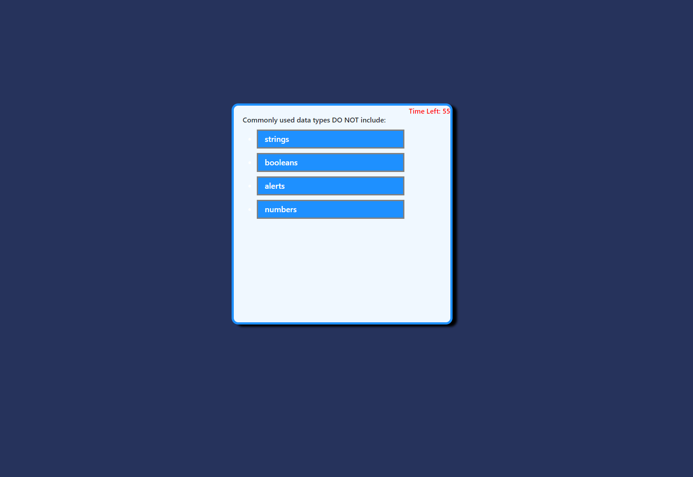

# Week 4 Homework Assignment

## CODE QUIZ

This is a timed quiz with multiple choice questions that is run in the browser and features dynamically updated HTML and CSS powered by JavaScript.

* A timer starts when you click the 'Start' button
* Questions are then presented to the user with multiple choice answers
* If the user selects the incorrect answer, 5 seconds will be taken off the timer
* The quiz is complete if all questions are answered or the timer reaches 0
* The user can save their initials and score
* A highscore board is created that displays all the previous scores.  This can be reset.
 
 